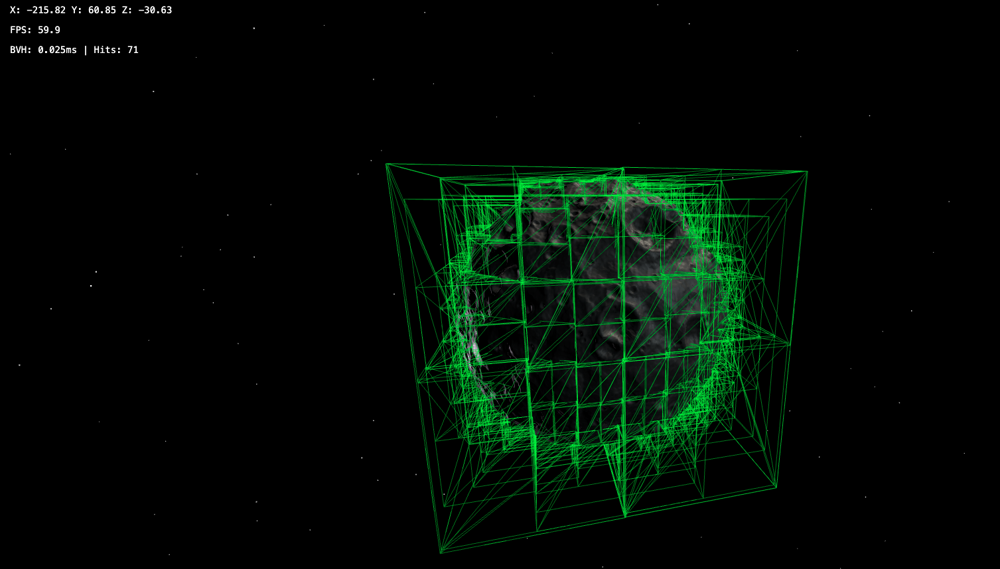
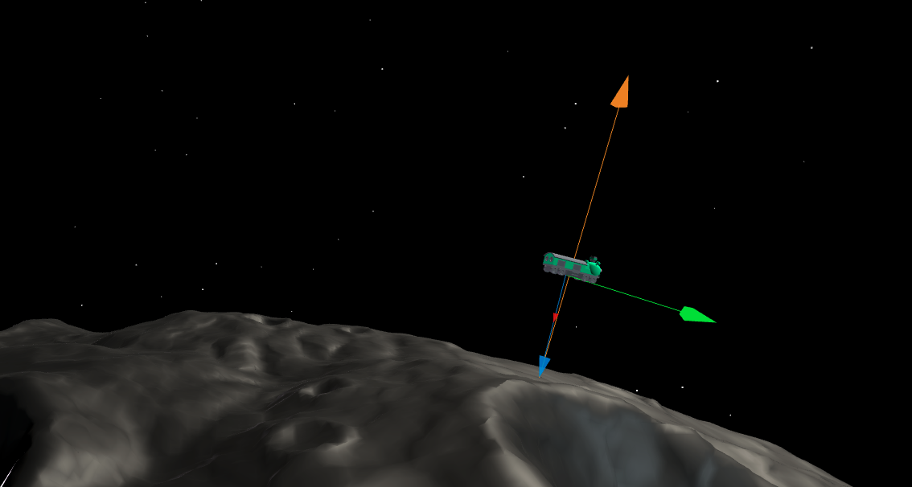
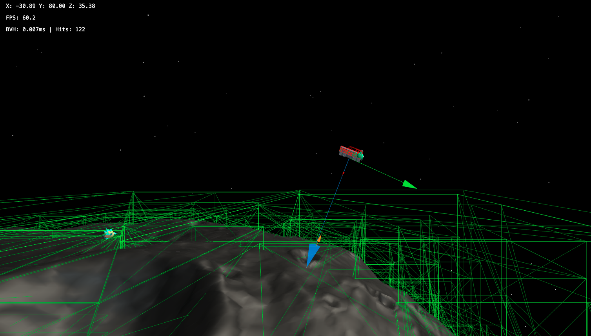

# Astroline
3D web world on moons. A game engine built with three.js, simulating physics and managing entities with high polycounts. Using BVH for fast raytracing with high poly models.

## Objectives

- A game where you can fly around moons with gravity pull
- Moon generator
- LOD if too heavy
- AI for bots
- Multiplayer support

## Debug Visualization

Press these keys to toggle debug visualizations:

- `H` - Disable debug rays
- `M` - Surface raycasting rays
- `N` - Surface normals
- `G` - Gravity debug visualization
- `B` - Direction debug visualization

### Debug Screenshots

*Collision detection boxes visualization*

*Gravity ray debugging visualization*

*Raycasting and collision boxes combined view*

## Architecture

### Managers for Core Systems:
- **Performance** - Direct references, no lookup overhead
- **Clear ownership** - Each manager owns its domain
- **Tight coupling** - Core systems need to work together closely
- **Game loop integration** - Managers participate in update cycles

### Services for Utilities:
- **Reusability** - Used across multiple managers
- **Optional features** - Can be disabled (debugging, logging)
- **Testability** - Easy to mock for testing
- **Flexibility** - Can be swapped out easily